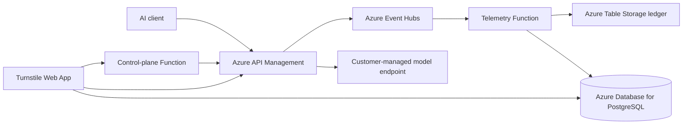

# Turnstile

Turnstile is a self-hosted control plane for governed AI model access. It combines an Azure API Management gateway, token and cost telemetry, budgets, application access, model onboarding, release controls, and an operational web console.

This repository deploys Turnstile infrastructure only. It does not create an Azure AI Foundry project, deploy provider models, or preload customer connections and models. Operators connect their own Foundry or compatible provider resources after the platform is running.

## Core capabilities

- Provider-neutral model, runtime, and gateway registry
- APIM-backed OpenAI and Anthropic-compatible endpoints
- Event Hub ingestion with PostgreSQL-backed usage and cost analytics
- Monthly budgets, model access policies, and application attribution
- Managed connection and model onboarding
- APIM native backend pools for failover, balanced, or weighted delivery
- Versioned gateway releases, integrity checks, rollback, and protected releases
- Owner-only application subscription provisioning and key management
- Password and Microsoft Entra authentication
- FinOps Assistant and report collections grounded in stored telemetry
- GitHub Copilot usage and governance integration

Model Intelligent Router is intentionally not part of this release. It may return as an optional extension in a future version.

## Architecture



APIM remains on the model request path. The web API and PostgreSQL are not synchronous inference dependencies. Turnstile stores usage metadata and provider-reported token counts; it does not persist prompts or completions.

See [Architecture](docs/architecture.md) for ownership and data-flow details.

## Repository layout

```text
backend/          FastAPI API, domain services, persistence, integrations
frontend/         React, TypeScript, Vite web application
functions/        Azure Functions for telemetry and control-plane work
infra/            Bicep modules, APIM policies, and deployment templates
migrations/       PostgreSQL migrations; 001 is the clean-install schema
contracts/        OpenAPI and Event Hub contracts
scripts/          Build and deployment staging utilities
tests/            Unit, contract, API, infrastructure, and source tests
docs/             Maintainer and operator documentation
```

## Prerequisites

- Python 3.11 or 3.12
- [uv](https://docs.astral.sh/uv/)
- Node.js 20+ and npm
- PostgreSQL 16+
- Azure CLI with Bicep for Azure deployment
- An Azure subscription where you can create the platform resources
- Optional: a multi-tenant Microsoft Entra SPA registration
- Optional after deployment: an existing Azure AI Foundry project or another supported provider

## Local setup

1. Create local configuration:

   ```bash
   cp .env.example .env
   cp frontend/.env.example frontend/.env.local
   ```

2. Set `DATABASE_URL`, generate independent values for `CREDENTIAL_ENCRYPTION_KEY` and `MANAGEMENT_API_KEY`, and configure authentication as described in [Configuration](docs/configuration.md).

3. Install dependencies:

   ```bash
   uv sync --frozen
   npm --prefix frontend ci
   ```

4. Apply the clean-install schema to an empty PostgreSQL 16+ database:

   ```bash
   uv run python -m backend.migrate
   ```

5. Start the API and frontend in separate terminals:

   ```bash
   uv run uvicorn backend.api:app --host 127.0.0.1 --port 8000
   npm --prefix frontend run dev -- --host localhost --port 5173
   ```

6. Open <http://localhost:5173>.

The Vite server proxies `/api` and `/health` to `API_PROXY_TARGET`, which defaults to `http://127.0.0.1:8000`.

## Configuration

All runtime configuration is environment-based. Real `.env` files, deployment parameter files, keys, logs, packages, and generated output are ignored by Git.

- Root template: [`.env.example`](.env.example)
- Frontend template: [`frontend/.env.example`](frontend/.env.example)
- Full reference: [Configuration](docs/configuration.md)

Never reuse secrets across environments. Keep `CONTROL_PLANE_ENABLED`, publication workers, and key-management features disabled until their Azure identities and least-privilege roles are deployed.

## Development and testing

```bash
uv run ruff check backend scripts tests functions/telemetry/function_app.py functions/control_plane/function_app.py
uv run mypy backend scripts tests
uv run pytest -q
npm --prefix frontend run build
az bicep build --file infra/main.bicep
xmllint --noout infra/policies/foundry-finops-policy.xml
npx --yes @redocly/cli@2.38.0 lint contracts/openapi.yaml
git diff --check
```

Tests use in-memory repositories only for isolated unit behavior. Integration and end-to-end claims must use a real Turnstile deployment and its configured Azure services. See [Testing](docs/testing.md) and [E2E Validation](docs/e2e-validation.md).

## Deployment

The Bicep templates create Turnstile platform resources such as PostgreSQL, Event Hubs, Storage, Key Vault, Application Insights, Web App, Functions, and APIM integration. They do not create Foundry projects or model deployments.

Always preview infrastructure changes:

```bash
az deployment sub what-if \
  --location <deployment-region> \
  --template-file infra/main.bicep \
  --parameters @infra/main.parameters.example.json \
  --parameters postgresAdministratorPassword='<secure-value>' \
               credentialEncryptionKey='<secure-value>' \
               managementApiKey='<secure-value>' \
               apimSubscriptionKey='<secure-value>' \
               apimProbeSubscriptionKey='<secure-value>'
```

Review the result before replacing `what-if` with `create`. Build and deploy application packages only after infrastructure succeeds. Detailed sequencing and verification are in [Deployment](docs/deployment.md).

## Post-deployment model onboarding

A fresh Turnstile deployment has no provider connection, runtime, or business model. From Model Management:

1. Add a connection to your existing Foundry project or supported provider.
2. Add a model using an existing provider deployment.
3. Optionally configure an APIM native backend pool for failover, balanced, or weighted routing.
4. Publish the gateway change and wait for verification.
5. Run a small attributed invocation and confirm its telemetry record.

## Security

- No prompt or completion content is persisted in telemetry.
- Credentials are encrypted before database storage.
- Azure-hosted components use managed identity where supported.
- APIM roles are scoped to the smallest practical resource and action set.
- Secret-bearing responses use `Cache-Control: no-store` and are never query-cached.
- Production cookies are HTTP-only, secure, and role-bound.
- Local and generated configuration is excluded by `.gitignore`.

Review [Security](docs/security.md) before deployment.

## Known limitations

- PostgreSQL is required; there is no supported local or embedded production data store.
- APIM and Azure resource provisioning can take several minutes.
- Streamed provider responses may not expose complete cache-write usage; affected cost rows remain explicit lower bounds.
- The frontend bundle is currently large and should be split in a future performance pass.
- `npm audit` reports four high-severity findings in the Vite build toolchain. The production dependency audit is clean, and npm currently proposes incompatible major downgrades rather than a safe fix; do not use `npm audit fix --force`.
- Model Intelligent Router is not included in this release.

## Troubleshooting

See [Troubleshooting](docs/troubleshooting.md) for database, authentication, APIM publication, telemetry, and App Service startup checks.

## License and contribution policy

This repository is private. Add a license and contribution policy before making it public. Use pull requests, require passing validation, and never commit deployment secrets or customer data.
