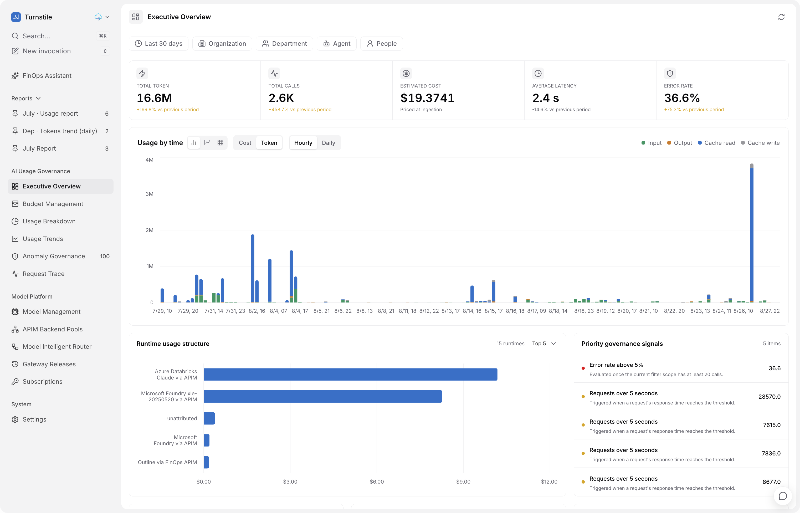

<p align="right">
   <strong>English</strong> | <a href="README.zh-CN.md">简体中文</a>
</p>

<p align="center">
   <a href="https://turn-stile.com">
      
   </a>
</p>

<h1 align="center">Turnstile</h1>

<p align="center"><strong>Governed AI access, spend, and operations through one self-hosted control plane.</strong></p>

<p align="center">
   
   <a href="LICENSE"></a>
   <a href="#prerequisites"></a>
   <a href="#prerequisites"></a>
   <a href="#deployment"></a>
</p>

<p align="center">
   <a href="https://turn-stile.com">🌐 Website</a> ·
   <a href="https://turn-stile.com/docs">📚 Docs</a> ·
   <a href="#local-setup">🛠️ Local setup</a> ·
   <a href="#deployment">🚀 Deployment</a> ·
   <a href="CONTRIBUTING.md">🤝 Contributing</a>
</p>

Turnstile is a self-hosted control plane for governed AI model access. It combines an Azure API Management gateway, token and cost telemetry, budgets, application access, model onboarding, release controls, and an operational web console.

> [!NOTE]
> **Turnstile v1.0** is the current public release. The project is evolving rapidly, so APIs, configuration, and deployment workflows may change as it matures. Review changes carefully before upgrading production deployments.

> [!IMPORTANT]
> The included infrastructure templates deploy only the Turnstile platform. They do not create an Azure AI Foundry project, deploy provider models, or preload customer connections and models. Operators connect their own Foundry or compatible provider resources after the platform is running.

<p align="center">
   <a href="docs/assets/product-overview.png">
      
   </a>
</p>
<p align="center"><sub>Executive overview across usage, cost, reliability, and governance. This product screenshot is redacted for public use.</sub></p>

## Core capabilities

- Provider-neutral model, runtime, and gateway registry
- APIM-backed OpenAI and Anthropic-compatible endpoints
- Event Hub ingestion with PostgreSQL-backed usage and cost analytics
- Monthly budgets, model access policies, and application attribution
- Managed provider connections and model registry APIs
- APIM native backend pools for failover, balanced, or weighted delivery
- Versioned gateway releases, integrity checks, rollback, and protected releases
- Owner-only application subscription provisioning and key management
- Password-based and Microsoft Entra authentication
- FinOps Assistant and report collections grounded in stored telemetry
- GitHub Copilot usage and governance integration (in active development)

> [!WARNING]
> The GitHub data source and GitHub Copilot integration are still under active development and are not production-ready. Enable them with care, and independently verify usage, cost, and governance data before relying on it for operational or financial decisions. If you only need FinOps for GitHub Copilot, see [OctoFinance](https://github.com/satomic/OctoFinance).

Model Intelligent Router is intentionally not part of this release. It may return as an optional extension in a future version.

## Architecture

Turnstile separates the inference data plane from its management plane. Clients call Azure API Management, which applies authentication, budget, and model-access policy before selecting a provider route. A response-aware observer emits metadata-only usage events to Event Hubs; Azure Functions persist and reconcile them in PostgreSQL. The FastAPI application and React console manage registry, governance, and release state without sitting on the provider request path. See [Architecture](docs/architecture.md).

## Repository layout

```text
backend/          FastAPI entry points, HTTP routes, and web-only services
turnstile_core/   Shared domain, persistence, integrations, and worker services
frontend/         React, TypeScript, Vite web application
functions/        Azure Functions for telemetry and control-plane work
infra/            Bicep modules, APIM policies, and deployment templates
migrations/       PostgreSQL migrations; 001 is the clean-install schema
contracts/        OpenAPI and Event Hub contracts
scripts/          Build and deployment staging utilities
tests/            Unit, contract, API, infrastructure, and source tests
docs/             Maintainer and operator documentation
```

## Prerequisites

- Python 3.11+
- [uv](https://docs.astral.sh/uv/)
- Node.js 20.19.x or 22.12+ and npm
- PostgreSQL 16+
- Azure CLI with Bicep for Azure deployment
- An Azure subscription where you can create the platform resources
- Optional: a multi-tenant Microsoft Entra SPA registration
- Optional after deployment: an existing Azure AI Foundry project or another supported provider

## Local setup

1. Create local configuration:

   ```bash
   cp .env.example .env
   cp frontend/.env.example frontend/.env.local
   ```

2. Set `DATABASE_URL`, generate independent values for `CREDENTIAL_ENCRYPTION_KEY` and `MANAGEMENT_API_KEY`, and configure authentication as described in [Configuration](docs/configuration.md).

3. Install dependencies:

   ```bash
   uv sync --frozen
   npm --prefix frontend ci
   ```

4. Apply the clean-install schema to an empty PostgreSQL 16+ database:

   ```bash
   uv run python -m backend.migrate
   ```

5. If you use password authentication, create the first Owner account. The command prompts for a password of at least 12 characters:

   ```bash
   uv run python -m backend.accounts owner@example.com --role owner
   ```

6. Start the API and frontend in separate terminals:

   ```bash
   uv run uvicorn backend.api:app --host 127.0.0.1 --port 8000
   npm --prefix frontend run dev -- --host localhost --port 5173
   ```

7. Open <http://localhost:5173>.

The Vite server proxies `/api` and `/health` to `API_PROXY_TARGET`, which defaults to `http://127.0.0.1:8000`.

## Configuration

All runtime configuration is environment-based. Real `.env` files, deployment parameter files, keys, logs, packages, and generated output are ignored by Git.

- Root template: [`.env.example`](.env.example)
- Frontend template: [`frontend/.env.example`](frontend/.env.example)
- Full reference: [Configuration](docs/configuration.md)

Never reuse secrets across environments. Keep `CONTROL_PLANE_ENABLED`, publication workers, and key-management features disabled until their Azure identities and least-privilege roles are deployed.

## Development and testing

```bash
uv run ruff check backend turnstile_core scripts tests functions/telemetry/function_app.py functions/control_plane/function_app.py
uv run mypy backend turnstile_core scripts tests
uv run pytest -q
npm --prefix frontend run build
az bicep build --file infra/main.bicep
xmllint --noout infra/policies/foundry-finops-policy.xml
npx --yes @redocly/cli@2.38.0 lint contracts/openapi.yaml
git diff --check
```

In-memory repositories are used only for isolated unit tests. Integration and end-to-end claims must use a real Turnstile deployment and its configured Azure services. See [Testing](docs/testing.md) and [E2E Validation](docs/e2e-validation.md).

## Deployment

The Bicep templates create Turnstile platform resources such as PostgreSQL, Event Hubs, Storage, Key Vault, Application Insights, Web App, Functions, and APIM integration. The deployment does not create an Azure AI Foundry project or provider model deployment.

1. Copy the public parameter example into an ignored file and set the subscription-independent values, including resource names, regions, publisher email, and `bootstrapOwnerEmail`:

```bash
mkdir -p .turnstile
cp infra/main.parameters.example.json .turnstile/main.parameters.json
```

2. Sign in to Azure, select a subscription, and run the repository deployment command:

```bash
az login
uv sync --frozen
uv run python -m scripts.deploy deploy \
   --subscription <subscription-id> \
   --parameters .turnstile/main.parameters.json
```

The command prompts for the initial Owner password, runs a subscription-scope what-if, and requires the exact confirmation `deploy`. It stops on any Delete change. It then provisions the platform and observer, builds immutable Linux x86-64 packages, deploys the API and Functions, enables workers only after the observer exists, and verifies health, Function indexing, and password Owner login. Generated secrets are stored only in `.turnstile/deployments/<resource-group>.json` with mode `0600`; back up that ignored file in an approved secret store.

For automation, copy `infra/owner.credentials.example.json` to `.turnstile/owner.credentials.json`, set the same email as `bootstrapOwnerEmail`, choose the password, run `chmod 600` on the file, and add `--owner-credentials .turnstile/owner.credentials.json`. Plaintext never enters Bicep or deployment state; only its scrypt hash is deployed.

Use `scripts.deploy plan` for a preview without creating resources. See [Deployment](docs/deployment.md) for prerequisites, reruns, and recovery.

## Post-deployment model onboarding

A fresh Turnstile deployment has no provider connection, runtime, or business model.

1. Sign in with the password Owner created by the deployment command.
2. In Model Management, add a connection to an existing Foundry project or supported provider, then choose Add Model for an existing provider deployment.
3. Optionally configure an APIM native backend pool for failover, balanced, or weighted routing.
4. Publish the gateway change and wait for candidate verification. For same-tenant Foundry managed identity, an authorization pause displays the exact APIM principal, `Cognitive Services User` role, and Foundry resource scope. Grant that role in Azure IAM, then resume verification in the dialog.
5. Run a small attributed invocation and confirm its telemetry record.

Turnstile never creates or modifies the customer Foundry project. The Azure user performing the IAM grant must already be authorized on that resource.

## Security

- No prompt or completion content is persisted in telemetry.
- Credentials are encrypted before database storage.
- Azure-hosted components use managed identity where supported.
- APIM roles are scoped to the smallest practical resource and action set.
- Secret-bearing responses use `Cache-Control: no-store` and are never query-cached.
- Production cookies set the `HttpOnly` and `Secure` attributes and are role-bound.
- Local and generated configuration is excluded by `.gitignore`.

Review [Security](docs/security.md) before deployment.

## Known limitations

- PostgreSQL is required; there is no supported local or embedded production data store.
- APIM and Azure resource provisioning can take several minutes.
- For streamed responses where the APIM policy cannot capture a usage breakdown, token and cost records are initially incomplete. Reconciliation restores prompt and completion counts when gateway logs are available, but per-request cache usage remains unknown and resulting costs may remain lower bounds.
- Model Intelligent Router is not included in this release.

## Troubleshooting

See [Troubleshooting](docs/troubleshooting.md) for startup, authentication, database, APIM, observer, and telemetry diagnostics. Deployment failures are resumable: correct the reported cause and rerun the same `scripts.deploy deploy` command with the original private state file.

## Documentation

| Guide | What it covers |
| --- | --- |
| [Documentation index](docs/README.md) | Entry point for operators and maintainers |
| [Architecture](docs/architecture.md) | Runtime boundaries, ownership, and data flow |
| [Configuration](docs/configuration.md) | Environment variables, authentication, and feature gates |
| [Deployment](docs/deployment.md) | Azure provisioning, packaging, rollout, and verification |
| [Testing](docs/testing.md) | Local, contract, infrastructure, and end-to-end validation |
| [Security](docs/security.md) | Threat boundaries, secret handling, and deployment controls |
| [Troubleshooting](docs/troubleshooting.md) | Database, authentication, APIM, telemetry, and startup checks |

## Contributing

Contributions should be focused, tested, and free of deployment secrets or customer data. Read [CONTRIBUTING.md](CONTRIBUTING.md) for the development workflow and [SECURITY.md](SECURITY.md) for responsible vulnerability reporting.

## License

Turnstile is released under the [MIT License](LICENSE). Third-party product names and trademarks shown in documentation or screenshots remain the property of their respective owners; their appearance does not imply endorsement.
